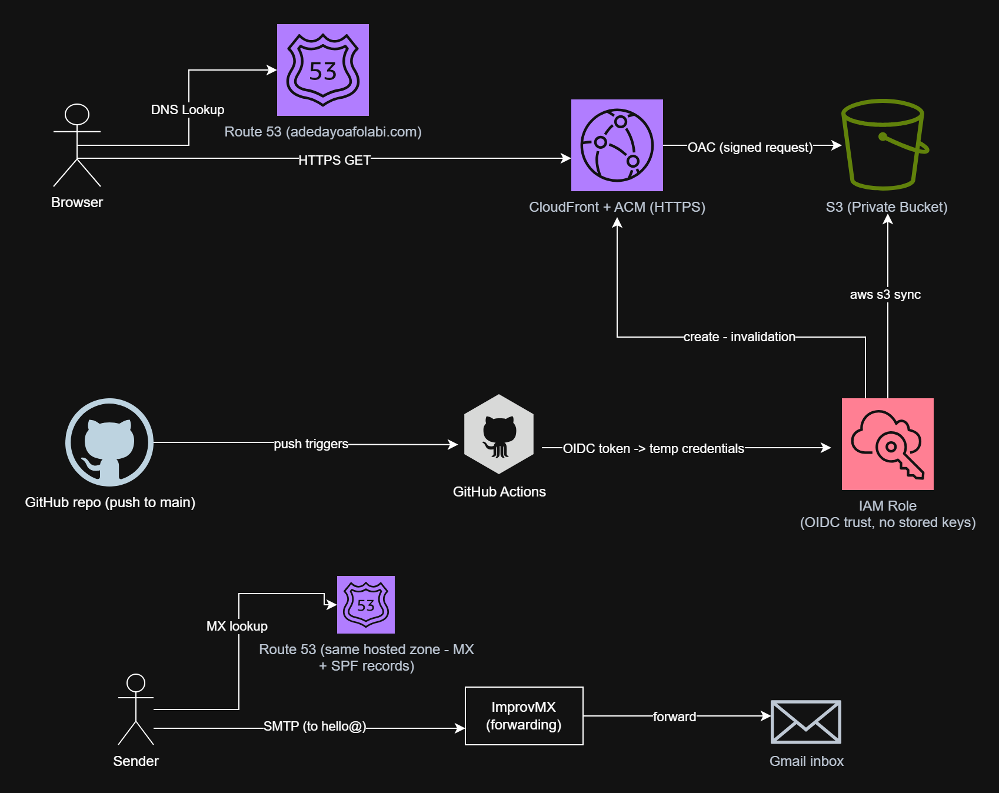

# adedayoafolabi.com — Cloud-Hosted Portfolio with Automated Deployment

Personal portfolio site served globally over HTTPS, with every piece of
infrastructure defined in Terraform and every deployment automated through
GitHub Actions. Live at **[adedayoafolabi.com](https://adedayoafolabi.com)**.

Built as Project 1 of a hands-on AWS cloud engineering program. The goal was
not "put a website online" — it was to build a production-shaped static
hosting platform: private origin, CDN in front, DNS and certificates managed
as code, and a CI/CD pipeline that authenticates without a single stored
AWS access key.

## Architecture



The S3 bucket is not public. CloudFront reaches it through an Origin Access
Control (OAC), and the bucket policy admits only that distribution. Visitors can never bypass the CDN and hit the bucket directly.

**Email path:** `hello@adedayoafolabi.com` is a real, monitored address. MX
records in Route 53 direct inbound mail to a forwarding service (ImprovMX),
which relays to a personal inbox. An SPF record authorizes the forwarding
servers so relayed mail survives spam filtering. Both records are managed in
Terraform like everything else.

## Key decisions

**No stored AWS credentials in CI.** The GitHub Actions workflow
authenticates via OpenID Connect: GitHub issues a short-lived signed token,
and an IAM role trusts that token only when it comes from this specific
repository on the `main` branch. There is no access key to leak, rotate, or
forget.

**Least-privilege IAM.** The deploy role can do exactly four things:
list/put/delete objects in the one site bucket, and create invalidations on
the one distribution. Nothing else in the account is reachable from CI.

**Everything in Terraform.** All 18 resources — bucket, bucket policy,
versioning, public-access block, CloudFront distribution, OAC, ACM
certificate, six Route 53 records, MX and SPF records, OIDC provider, IAM
role and policy — are code. `terraform plan` returns "No changes" against
the live environment. Resources originally created in the console were
brought under management with `terraform import` rather than recreated,
which meant reconciling real-world state with code (a more realistic
exercise than greenfield).

**Private-by-default security posture.** S3 Block Public Access on,
versioning on, TLS-only via CloudFront, DNS-validated certificate covering
apex and www.

## A debugging story: the OIDC trust policy

The pipeline initially failed on `sts:AssumeRoleWithWebIdentity` even though
the trust policy matched GitHub's documented subject format
(`repo:OWNER/REPO:ref:refs/heads/main`). Rather than loosening the policy to
a wildcard, I added a debug step to decode the actual JWT claims GitHub was
sending. The token's `sub` claim used a newer format that appends immutable
numeric owner and repository IDs — GitHub changed the format for
repositories created after mid-2026. Updating the trust policy to the exact
observed claim fixed authentication while keeping `StringEquals` (exact
match) instead of falling back to a permissive wildcard.

Lesson: read what the system actually sends before weakening a security
control to make an error disappear.

## Stack

| Layer | Service |
|---|---|
| Static hosting | Amazon S3 (private bucket) |
| CDN / TLS termination | Amazon CloudFront + OAC |
| DNS | Amazon Route 53 |
| Certificate | AWS Certificate Manager (DNS-validated) |
| Email forwarding | Route 53 MX/SPF + ImprovMX |
| CI/CD | GitHub Actions with OIDC federation |
| Infrastructure as Code | Terraform |

## Repository layout

```
.
├── index.html, assets/        # site content, synced to S3
├── .github/workflows/         # deploy pipeline (sync + invalidation)
└── terraform/                 # all infrastructure (state kept local,
                               #   excluded from git — state contains secrets)
```

## Cost

Runs at roughly **$0.50/month** (Route 53 hosted zone) plus the annual
domain registration. S3, CloudFront, ACM, Lambda-free email forwarding, and
GitHub Actions usage all sit inside free tiers at portfolio traffic levels.

## Running it yourself

1. Register a domain and create a Route 53 hosted zone for it.
2. Adjust `terraform/` variables (domain name, region), then
   `terraform init && terraform apply`.
3. Create the GitHub repository, add the OIDC role ARN as a repository
   variable, and push — the workflow deploys on every commit to `main`.

---